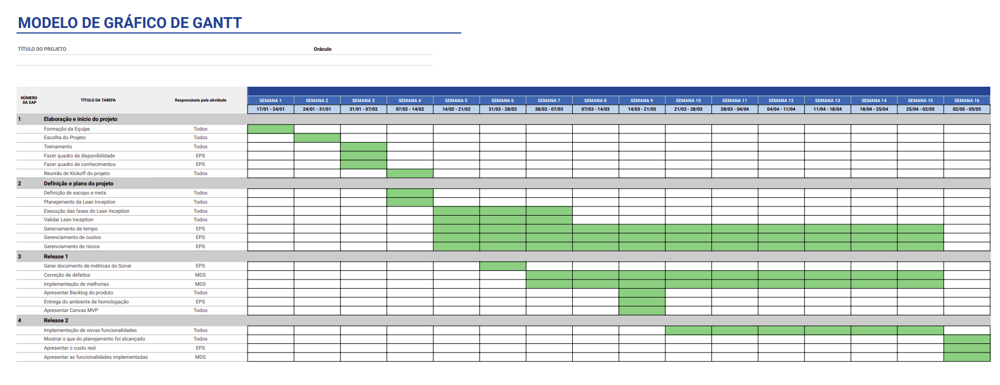

# Diagrama de Gantt

## Histórico de Revisão

|Data|Versão|Descrição|Autor|
|--|--|--|--|
|17/03/2022|0.1|Criação da estrutura inicial do documento|Caio César Beleza|
|17/03/2022|0.2|Criação da estrutura inicial do documento|Caio César, Lucas Lopes e João Victor|

## 1. Introdução

O Diagrama de Gantt é uma representação visual do cronograma de um projeto e fornece uma forma mais fácil de controle e gerência desse projeto. Essa ferramenta consiste em dividir o projeto em atividades e estimar o tempo necessário para executá-las.

O gráfico mostra as tarefas que precisam ser feitas, a ordem entre elas, quando têm que ser iniciadas e a estimativa de quando serão finalizadas.

## Referências

Artia. Gráfico de Gantt: o que é, para que serve e como fazer. Disponível em: https://artia.com/blog/grafico-de-gantt-o-que-e-para-que-serve-e-como-montar-o-seu/ . Acesso em: 17/03/2022.

Nomus.Gráfico de Gantt: o que é, como funciona e como montar o seu. Disponível em: https://www.nomus.com.br/blog-industrial/grafico-de-gantt/ .Acesso em 17/03/2022.
